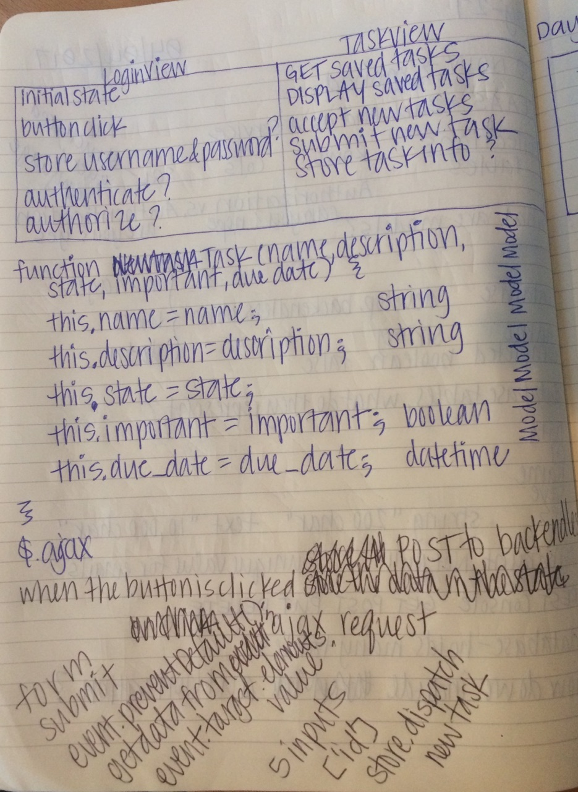
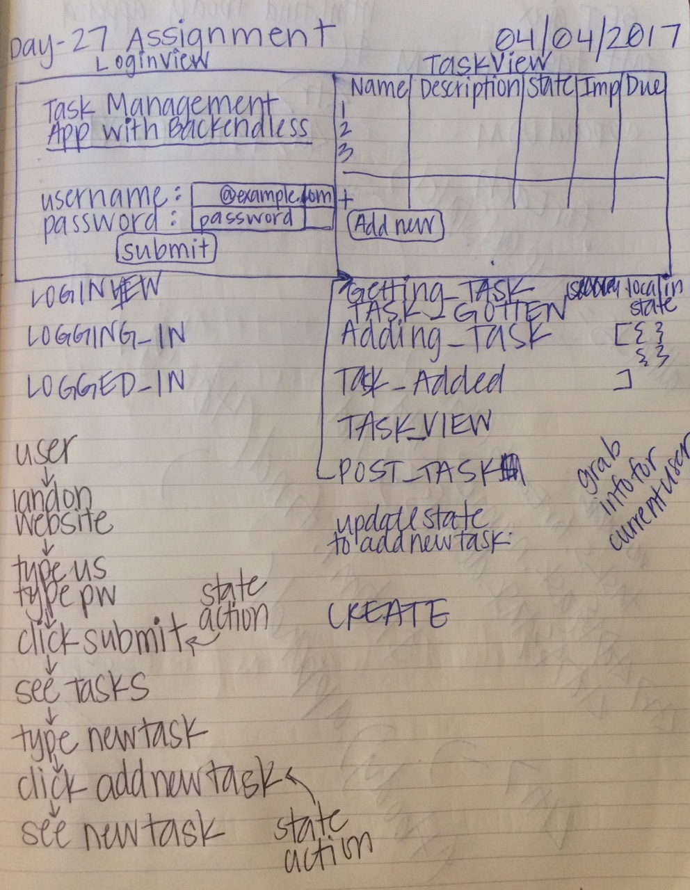

What is it?
-----------
TIY Front-End Spring 2017 Assignment

What should it do?
------------------

Using a fresh clone of the webpack-starter
Remember to refer to our notes and the redux chat app for getting the store and reducer setup.
Create a web app that requires a user to login in order to use it.
Once logged in, a user should be able to create a new task with a form. A task should have a name, description, state, important, and due date fields.
Make sure you create this table on backendless with all the appropriate constraints and types.
A user should also be able to see a list of all their tasks in tabular format. A user should NOT be able to see any tasks created by another user.
NOTES
To get started, as always, plan out your application first. What state will I have? What events will occur? What Model(s) will there be? What user actions/inputs will occur on each of your 'views'? What endpoints will you use to access/persist data?

To login as a user, refer to the backendless rest api docs
For your example accounts use an email you own or the @example.com domain.
Do not make up email addresses for testing
Use the same easy to remember password for all your user accounts, I strongly recommend going with just password as its easy to remember and should never be used as a real password.
To request data from the server, refer to the backendless rest api docs ;
To save a record to the database, refer to the backendless API documentation
To make any requests to backendless you will need the 3 things listed below. Make sure you store those in your app somewhere when getting started;

The backendless endpoint URL
Your application ID
Your REST secret key
Example API request with the headers set:

  $.ajax({
    url: APP_URL + "/tasks",
    method: "GET",
    headers: {
      "application-id": APP_ID,
      "secret-key": SECRET_KEY,
      "user-token": USER_AUTH_TOKEN
      // You get this auth token from authenticating at the login endpoint.
      //  Sending this with a POST request to create a task will make that task
      //  "belong" to that user. It will tie them together in the database.
    }
  })
WHAT TO SUBMIT
A link to a repository containing your project code.
In the Notes section, include a link to your project live on the internet
As always, in the Notes section, include your confidence (1-5) and if you are anything below 5, briefly explain why.
Adventurer Mode

Allow users to register to use the app if they don't already have an account.
Implement pagination when showing results. Only show 10 results per page, and allow a user to view the next or previous 10 results by clicking on an arrow at the bottom of the list.
Epic Mode

Allow a user to filter the results. Rather than do the filtering on the front end, make a new request to the server when the user requests filters. You could filter by: search term in name or status, date created, due date, important, etc. Have fun with this.

Planning
--------

  
  

--------------------------------------------------------------------------------
Created by Devon Moubry. devon@moubry.com
